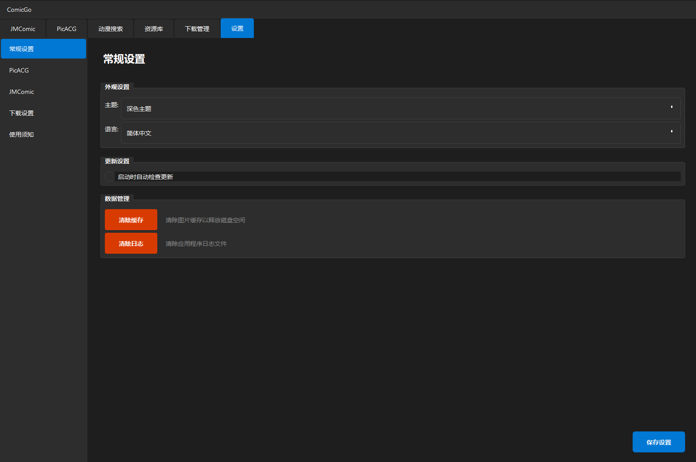
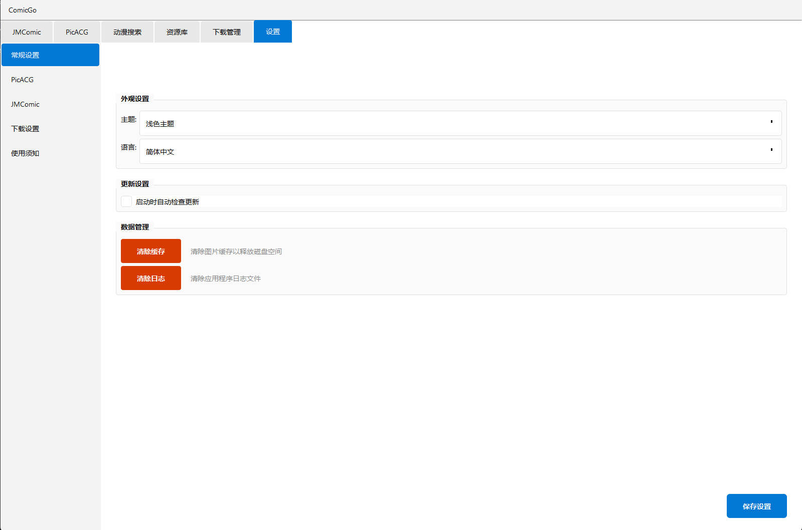

# 此仓库因初期架构规划不足，线程管理差，数据源扩充困难，即将归档停止更新。新版本将使用Flutter重构，请期待全新面貌，支持更高自由度，更多数据形式（动漫，漫画，直播，轻小说等）以及个人编写数据源规则（使用kazumirules的xpath架构）。目前已经实现了大部分功能，正在进行细节优化，近请期待（演示视频https://www.bilibili.com/video/BV1ViquBgEbs/?spm_id_from=333.337.search-card.all.click）


## PanComic

⚡ 一个简洁、高性能、支持多源的本地化漫画管理器（下载 + 阅读）


## ⚠️ 重要声明 - 负责任的使用承诺

**PanComic 致力于成为一个负责任的开源项目，我们郑重承诺：**

### 🚫 我们绝不提供的功能
- **批量下载** - 不提供一键下载整站、批量爬取等高频操作
- **批量导出** - 不提供大规模数据导出功能
- **恶意爬虫** - 不实现无节制的并发请求或绕过反爬机制

### 🛡️ 我们的技术限制
- **请求频率控制** - 内置合理的请求间隔，避免对源站造成压力
- **单线程下载** - 采用温和的下载策略，保护源站服务器
- **用户友好设计** - 优先考虑阅读体验而非下载速度

### 📋 使用者责任
**如果您使用 PanComic 或基于其源码进行开发，请务必：**
1. **遵守此承诺** - 不添加批量下载等高危功能
2. **尊重源站** - 合理使用，避免给源站造成负担
3. **标注来源** - 在衍生项目中保留此声明
4. **自负责任** - 因违反此承诺导致的后果由使用者承担

### 🤝 共同维护
我们相信，只有所有使用者共同遵守这些原则，才能：
- 保护漫画源站的正常运营
- 避免用户IP被封禁的风险
- 维护整个社区的长期利益
- 确保项目的可持续发展

**让我们一起做负责任的开发者和使用者！** 💪


## ✨ 功能特性

- 🔍 **多源搜索** - 支持众多漫画源
- 📖 **在线阅读** - 流畅的阅读体验，健全的阅读器功能，支持缓存加速
- 📥 **批量下载** - 智能下载队列，支持断点续传
- 📚 **本地管理** - 完善的本地漫画库管理
- 🎨 **现代界面** - Fluent Design 风格 UI

## 📸 截图

深色模式

浅色模式


## 🚀 快速开始

### 环境要求

- Python 3.10+
- Windows / macOS / Linux

### 安装

```bash
# 克隆仓库
git clone https://github.com/yourusername/PanComic.git
cd PanComic

# 安装依赖
pip install -r pancomic/requirements.txt

# 运行
python -m pancomic.main

# 自行打包（确保包含了PanComic.spec文件）
pyinstaller PanComic.spec --clean
```


## 📁 项目结构

```
PanComic/
├── pancomic/              # 主程序
│   ├── adapters/          # 漫画源适配器
│   ├── controllers/       # 控制器
│   ├── core/              # 核心模块
│   ├── models/            # 数据模型
│   ├── ui/                # 用户界面
│   │   ├── pages/         # 页面
│   │   ├── widgets/       # 组件
│   │   └── dialogs/       # 对话框
│   └── infrastructure/    # 基础设施
├── forapi/                # API 封装
│   ├── jmcomic/           # JMComic API
│   └── picacg/            # PicACG API
└── downloads/             # 下载目录（首次运行生成）
```

## 🤔 待更新功能（无优先级）

- [ x ]优化jmcomic搜素，以支持jm号搜索
- [ x ]优化picacg搜索功能（目前搜索结果只有前20条）
- [ x ]Gui美化，渐变，操作响应强化，任务状态弹出信息条
- [√/×]扩充更多漫画源（添加中....）
- [ × ]为动漫播放添加计时器，以窗口句柄捕捉或是否为焦点窗口的方式计时动漫剧集的集数和播放时间，在gui中显示：上次播放到n集x分钟
- [ × ]添加启动闪屏进度条或二次元gif，应用进行初始化（如登陆，窗口创建，漫画源可用性检测）时显示，初始化完成后关闭并显示主窗口
- [ × ]添加拷贝漫画的章节适配

   - 已支持的漫画/动画源
     
                       - 禁漫天堂
                       - 哔咔漫画 
                       - 绅士漫画（wnacg.com）
                       - 拷贝漫画（2025copy.com）
                       - 樱花动漫（dm569.com）

   - 准备更新的漫画源

                       - ehentai(exhentai.org)
                       - BZ漫画（mangabz.com）
     
     
  

## 🖊 更新日志

### 📅 v0.3.0 - 2025/12/31 🎉 新年版本

#### 🆕 新增功能
- **📚 新漫画源**
  - 新增 **拷贝漫画** (2025copy.com) 支持
  - 完善漫画源热插拔机制

- **🎬 动漫播放功能**
  - 新增 **樱花动漫** (dm569.com) 支持
  - 智能解析播放页面，提供解密后 M3U8 播放链接
  - 一键浏览器播放，确保无广告体验
  - **注意**：仅提供播放功能，不提供下载（遵循负责任使用原则）

#### ⚡ 性能优化
- **多线程架构重构**
  - 实现四线程并行处理：爬虫 → 解析 → 渲染 → 主线程
  - 渐进式内容提交，显著提升响应速度
  - 彻底解决界面卡顿问题
  - 制定 `apply_optimization_to_other_pages.md` 优化规范

#### 🔔 用户体验提升
- **任务状态反馈系统**
  - 设计非侵入式弹窗通知模板 (`notification_system_demo.py`)
  - 为后续版本的任务状态提示奠定基础
  - 涵盖：添加、开始、删除、完成等操作反馈

- **版本检测系统**
  - 现在pancomic可以从relaese中检测和下载新或旧版本，0.x.0是预发行版本，x.x.x是正式版本
  - 但还未实现数据集成，需要手动覆盖download文件夹到新获取的版本

#### 🏷️ 界面改进
- **动漫卡片优化**
  - 新增来源标识：🔵 **视频** (DM569) / 🟢 **WIKI** (Bangumi)
  - 优化资源库页面分割器控制，防止面板异常扩大
  - 修复部分按钮图标显示问题

- 预发行版本 release-v0.3.0
---

### 📅 v0.2.0 - 2025/12/28

#### 🆕 新增功能
- **📖 新漫画源**
  - 新增 **绅士漫画** (wnacg.com) 支持
  - 实现漫画源热插拔功能

- **📁 本地管理增强**
  - 支持拖拽文件夹导入本地漫画
  - 自动生成 `/user` 文件夹管理导入内容
  - 完善资源库兼容性

#### 🔧 技术改进
- 制定 `add_comicsource_rule.md` 开发规范
- 优化部分线程处理逻辑
- 强化阅读器稳定性

- 预发行版本 release-v0.2.0
---

### 📅 v0.1.0 - 2025/12/27 🚀 首次发布

#### 🎉 项目启动
- **📦 核心功能**
  - 多源漫画搜索与阅读
  - 智能下载队列管理
  - 现代化 Fluent Design UI
  - 本地漫画库管理

- **🔍 支持的源**
  - 禁漫天堂 (JMComic)
  - 哔咔漫画 (PicACG)

- **📋 发布内容**
  - 开源项目代码
  - 预发行版本 release-v0.1.0


## ⚠️ 免责声明

- 本项目仅供学习和研究使用
- 不提供任何漫画内容，所有内容来自第三方
- 请遵守当地法律法规
- 涉及成人内容时，请确保已满 18 岁
